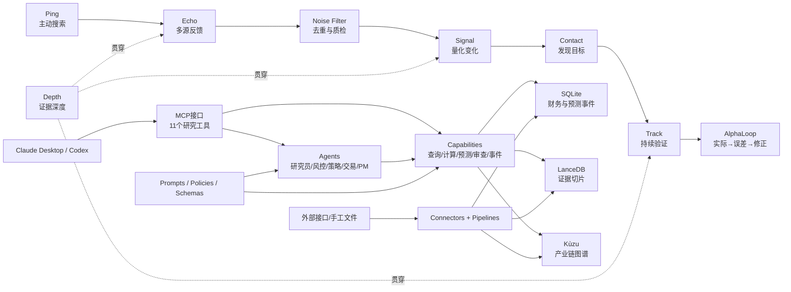
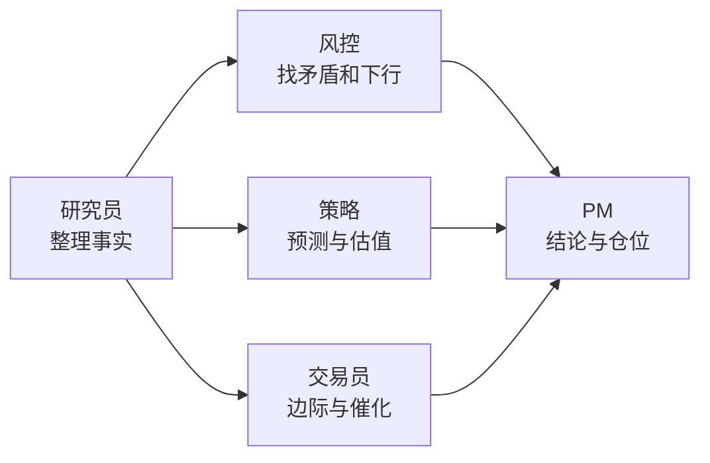
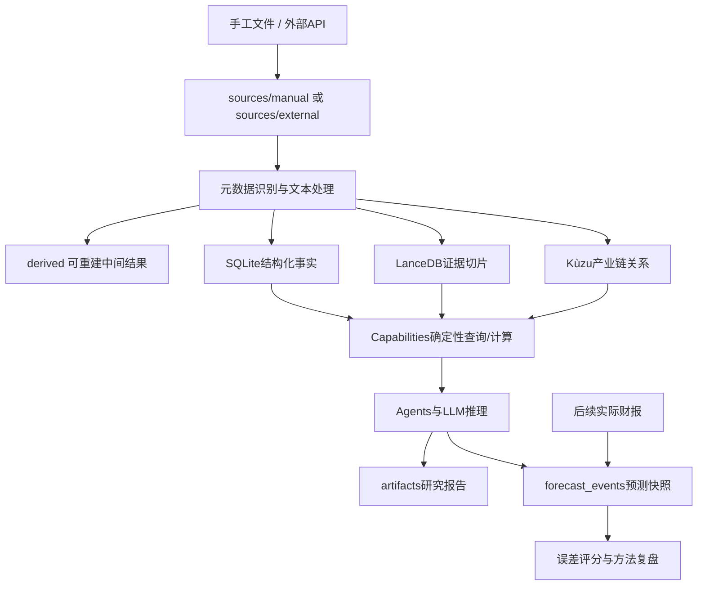

# AlphaSonar项目设计总览

> 本文是项目的快速入口。目标是在10分钟内理解系统边界、目录结构、数据如何流动，以及修改某类功能应该去哪里。

## 1. 项目定位

AlphaSonar是一个面向买方研究的私有投研系统。它把本地财务数据、公司公告、券商研报、专家纪要、新闻和产业链关系组织成可追溯证据，再通过MCP向Claude Desktop、Codex等客户端提供研究工具。

统一命名体系：品牌使用 **AlphaSonar**，用户命令使用 `alpha-` 前缀，代码命名空间和环境变量使用 `alphasonar` / `ALPHASONAR_*`。产品语言按研究链路定义：

| 阶段 | 定义 | 工程落点 |
|---|---|---|
| **Ping** | 主动搜索公告、研报、纪要和新闻 | Connectors、Scheduler、公司数据更新入口 |
| **Echo** | 接收并对齐不同来源的反馈 | LanceDB检索、多源互证 |
| **Noise Filter** | 过滤重复、传闻、过期和低质量信息 | Pipeline去重、来源分类、时效与口径护栏 |
| **Signal** | 提取可量化的业绩变化 | Calculator、Forecast、Marginal Change |
| **Contact** | 发现潜在Alpha目标 | Event Catalyst、产业链传播、机会筛选 |
| **Track** | 持续跟踪预测和关键验证点 | Watchlist、文件监控、预测快照 |
| **Depth** | 描述证据深度与可信度 | 来源层级、交叉验证、血缘和`source_id` |
| **AlphaLoop** | 用财报验证、复盘误差并修正模型 | `forecast_events`、评分与反馈策略 |

这八个词是产品语义，不要求机械拆成八个Python包；模块仍按接口、能力、连接器、流水线和存储分层。

系统当前重点解决四类问题：

1. 查询结构化财务数据并做同比、环比计算；
2. 基于官方指引、卖方预测和增量证据预测公司业绩；
3. 用向量检索和产业链图谱补充非结构化证据；
4. 保存预测快照，财报后复盘预测误差和修正因子质量。

系统不是通用聊天机器人，也不把模型记忆当作财务事实。数据库和本地证据是事实来源，LLM主要负责归纳、推理、冲突识别和报告表达。

## 2. 一张图理解系统



最重要的边界是：

- 代码和研究方法放在Git仓库；
- 原始数据、派生数据、数据库和报告输出放在`ALPHASONAR_RUNTIME_ROOT`；
- 所有路径统一经过`alphasonar.settings`，业务模块不自行拼本机路径。

## 3. 仓库目录

```text
alphasonar/
├── src/alphasonar/                    # 可安装Python核心包
│   ├── interfaces/mcp/         # MCP协议入口和工具注册
│   ├── agents/                 # 多Agent岗位编排
│   ├── capabilities/           # 可独立调用的研究能力
│   ├── connectors/             # 外部数据源连接器
│   ├── pipelines/              # 解析、标准化、切片和入库
│   ├── storage/                # SQLite/LanceDB/Kùzu适配层
│   ├── utils/                  # Prompt加载等通用工具
│   └── settings.py             # 全项目唯一运行路径配置入口
├── resources/                  # 版本化研究方法论
│   ├── prompts/                # Agent、Skill和报告提示词
│   ├── policies/               # 口径、血缘、预测护栏、反馈规则
│   ├── schemas/                # 财务变量定义
│   └── dictionaries/           # 公司、产品和别名词典
├── config/                     # 非敏感配置和本机配置模板
├── scripts/
│   ├── ops/                    # 可重复运行的运维和数据任务
│   ├── dev/                    # 诊断、重叠检查和图谱可视化
│   └── oneoff/                 # 特定报告的一次性交付脚本
├── deploy/                     # Docker、Compose和独立微信服务
├── tests/                      # 单元及回归测试
├── docs/                       # 设计、架构、迁移和PRD
├── pyproject.toml              # 依赖、包配置和命令行入口
└── uv.lock                     # 可复现依赖锁
```

### 修改功能时去哪里

| 需求 | 首选位置 |
|---|---|
| 新增一个MCP工具 | `src/alphasonar/interfaces/mcp/server.py` |
| 新增一项可复用研究能力 | `src/alphasonar/capabilities/` |
| 调整多Agent分工或顺序 | `src/alphasonar/agents/` |
| 接入新的数据平台 | `src/alphasonar/connectors/` |
| 修改PDF/Markdown解析和元数据分类 | `src/alphasonar/pipelines/` |
| 更换数据库或索引实现 | `src/alphasonar/storage/` |
| 修改研究规则、报告骨架 | `resources/prompts/`、`resources/policies/` |
| 修改字段或公司别名 | `resources/schemas/`、`resources/dictionaries/` |
| 新增定时/迁移/复盘任务 | `scripts/ops/` |
| 特定公司报告生成器 | `scripts/oneoff/` |

## 4. 核心模块职责

### 4.1 Interfaces：对外接口

`src/alphasonar/interfaces/mcp/server.py`是当前主入口，对外注册11个MCP工具：

| 工具 | 主要实现 | 作用 |
|---|---|---|
| `text2sql` | Skill 1 | 自然语言查询SQLite |
| `financial_dashboard` | Skill 2 | 纯Python财务同比/环比看板 |
| `graph_propagation` | Skill 3 | 查询产业链传导关系 |
| `adversarial_report` | Skill 4 | 多源对抗审查 |
| `earnings_forecast` | Skill 5 | 业绩预测与官方指引校验 |
| `price_target` | Skill 5 | 估值与目标价 |
| `marginal_change` | Skill 5 | 识别边际变化 |
| `relationship_graph` | Skill 5 | 产业链和竞争关系 |
| `opportunity_risk` | Skill 5 | 机会与风险情景 |
| `full_analysis` | Agents | 完整多岗位投研报告 |
| `event_catalyst` | Skill 6 | 事件、宏观和新闻催化分析 |

MCP层只做参数处理、数据召回和能力路由，不应在这里沉淀新的预测公式。

### 4.2 Agents：岗位化编排



`orchestrator.py`负责一次拉取共享数据，再把相同证据传给不同岗位，避免每个Agent重复查询并得到不同数据基线。

### 4.3 Capabilities：研究能力

Capabilities是系统中最适合单元测试和复用的一层：

- Skill 1负责自然语言到受约束SQL；
- Skill 2只做确定性财务计算，不调用LLM；
- Skill 3封装产业链查询；
- Skill 4做证据冲突和对抗审查；
- Skill 5承载业绩、估值、边际变化、关系图谱、机会风险五类核心分析；
- Skill 6把事件与宏观、新闻、产业链影响结合。

预测公式、口径护栏和证据分层应落在这一层或`resources/policies/`，而不是散落在MCP入口和一次性脚本中。

### 4.4 Connectors与Pipelines：数据进入系统

Connectors负责“取得原始数据”，包括EDGAR、AkShare、Tushare、YFinance、AceCamp和本地文件监控。Pipelines负责“把原始对象变成统一证据”，包括：

1. 读取PDF、Markdown或JSON；
2. 识别ticker、发布日期、报告期和`data_source`；
3. 文本分块并生成稳定`chunk_id`；
4. 写入LanceDB，同时保存来源和血缘元数据；
5. 重处理同一来源时先清除旧切片，防止陈旧证据残留。

### 4.5 Storage：三种存储的分工

| 存储 | 保存内容 | 关键对象 |
|---|---|---|
| SQLite | 确定性财务数值、价格、预测事件、修正因子、血缘 | `financial_reports`、`forecast_events`、`revision_factors` |
| LanceDB | 公告、研报、纪要、新闻的文本切片和向量 | `chunks` |
| Kùzu | 公司、产品、上下游关系 | `Company`、`Product`、`PRODUCES`、`UPSTREAM_OF` |

SQLite中的`forecast_events`采用append-only设计，同时保存`consensus`、`guidance`、`forecast`和`actual`。这样财报发布后可以比较AlphaSonar预测与一致预期谁更准确，并识别时间穿越。

## 5. 运行数据目录

推荐开发机和服务器都设置：

```bash
export ALPHASONAR_RUNTIME_ROOT=/path/to/alphasonar-runtime
```

目录由`Settings.from_env()`推导：

```text
$ALPHASONAR_RUNTIME_ROOT/
├── sources/
│   ├── manual/                 # 手工文件、官方导出；尽量只追加
│   └── external/               # API原始响应；尽量保持原貌
├── derived/                    # 清洗、转换、切片等可重建数据
├── stores/
│   ├── relational/alphasonar.db       # SQLite主库
│   ├── vector/lancedb_root/    # LanceDB
│   └── graph/kuzu_root.db      # Kùzu
├── artifacts/                  # Markdown、PDF、Excel、图谱HTML
└── cache/                      # 可清理临时文件
```

未设置`ALPHASONAR_RUNTIME_ROOT`时，系统仍读取旧的仓库内目录。这只是迁移兼容模式，不是服务器推荐配置。

## 6. 端到端数据流



数据治理原则：

- 原始对象尽量只追加，不原地覆盖；
- `derived`和索引必须可从原始对象重建；
- 预测快照、人工反馈和血缘属于不可重建状态，必须备份；
- 报告中的关键数字必须能回到`source_id`、文件或数据库记录；
- 新闻和专家纪要不能直接冒充官方指引或卖方一致预期。

## 7. 业绩预测的证据结构

系统用四层证据隔离减少口径混淆：

1. **历史实际值**：SQLite财务数据，用于基数和口径校验；
2. **公司官方信息**：财报、公告、业绩指引；
3. **卖方一致预期**：券商报告中的季度和年度预测；
4. **增量证据**：专家纪要、新闻和产业链信息，只用于有证据的修正。

研究输出的基本顺序是：历史基数校验 → 官方指引 → 卖方基准 → 增量修正 → Bull/Base/Bear → 后续复盘。

其中三个硬约束最重要：

- 存在官方材料但指引抽取失败时，不能静默退化为机械预测；
- 不允许用全年除以4或固定季节性比例拆季度；
- 预测超出公司指引区间时必须给出量化证据、来源和失效条件。

详细规则见`resources/policies/forecast_guardrails.md`和`resources/prompts/instructions.md`。

## 8. 配置与密钥

配置优先级为：`ALPHASONAR_*`具体路径变量 > `ALPHASONAR_RUNTIME_ROOT`推导值 > 原`IRA_*`兼容变量 > 旧目录兼容值。

常用变量：

| 变量 | 用途 |
|---|---|
| `ALPHASONAR_RUNTIME_ROOT` | 整体运行数据根目录 |
| `ALPHASONAR_MANUAL_SOURCE_ROOT` | 覆盖手工来源目录 |
| `ALPHASONAR_EXTERNAL_SOURCE_ROOT` | 覆盖外部原始响应目录 |
| `ALPHASONAR_DERIVED_ROOT` | 覆盖派生数据目录 |
| `ALPHASONAR_ARTIFACT_ROOT` | 覆盖输出目录 |
| `ALPHASONAR_SQLITE_PATH` | 覆盖SQLite主库 |
| `ALPHASONAR_LANCE_PATH` | 覆盖LanceDB路径 |
| `ALPHASONAR_KUZU_PATH` | 覆盖Kùzu路径 |
| `ALPHASONAR_RESOURCE_ROOT` | 覆盖版本化资源目录 |
| `ANTHROPIC_API_KEY` | LLM调用凭证 |
| `TUSHARE_TOKEN` | Tushare凭证 |

真实密钥和Cookie只能放环境变量、Secret Manager或Git已忽略的本机配置中。`config/*.example.*`可以提交，`config/api_keys.json`和`config/acecamp.json`不能提交。

## 9. 常用入口

```bash
# 安装开发环境
pip install -e '.[dev]'

# 初始化SQLite Schema
alpha-init

# 启动MCP stdio服务
alpha-mcp

# 监控手工输入目录
alpha-track

# 更新一个公司的多类证据
python scripts/ops/refresh_company_data.py --ticker AMD.US --company AMD

# 记录预测或财报实际值，并计算历史误差
python -m scripts.ops.forecast_snapshot record --help
python -m scripts.ops.forecast_snapshot score --ticker AMD

# 旧运行目录迁移：先预演，再复制
python scripts/ops/migrate_runtime_layout.py --runtime-root /srv/alphasonar
python scripts/ops/migrate_runtime_layout.py --runtime-root /srv/alphasonar --execute

# 测试
pytest -q
```

## 10. 部署设计

`deploy/docker/Dockerfile`按`uv.lock`构建代码和版本化资源；`deploy/compose/compose.yml`把宿主机运行目录挂载到容器`/srv/alphasonar`，并启动带Bearer Token鉴权的Streamable HTTP MCP。默认只监听宿主机`127.0.0.1:8000`，端点为`/mcp`，公网部署必须再经HTTPS反向代理。密钥目录通过`ALPHASONAR_SECRETS_DIR`挂到`/run/secrets`，其中使用`anthropic_api_key`、`tushare_token`和`alphasonar_mcp_token`三个纯文本文件；Compose配置只显示文件路径，不展开密钥内容。

服务器遵循以下规则：

- 镜像升级不得覆盖运行数据；
- 凭证由部署环境注入；
- HTTP MCP必须配置`ALPHASONAR_MCP_TOKEN`，不得裸露无鉴权端点；
- SQLite、LanceDB和Kùzu使用持久卷；
- 同一存储实例只保留一个写入Worker，查询进程以只读为主；
- 并发和数据规模提高后，优先把SQLite替换成PostgreSQL，保持上层能力接口不变。

微信文章下载服务位于`deploy/wechat-download-api/`，它独立管理登录态和抓取节奏；AlphaSonar只通过同步脚本读取其本地Feed，不接收微信Cookie。

## 11. 开发约束

1. 新代码统一使用`alphasonar.*`导入，不再使用旧的`src.*`路径；
2. 不在业务代码里硬编码`data/`、`databases/`、`output/`绝对或相对路径；
3. Connector只负责获取，Pipeline只负责转换，Storage只负责持久化；
4. 确定性计算优先使用Python/SQL，LLM不参与基础算术；
5. 任何预测数字都要记录口径、截止日期、来源和计算依据；
6. 一次性报告脚本放`oneoff`，可重复运维任务放`ops`；
7. 修改Schema、提示词或预测护栏时必须补回归测试；
8. 运行数据、数据库、密钥和输出不得加入Git。

## 12. 当前演进状态

项目已经完成代码目录和运行数据的逻辑解耦，并保留旧目录兼容读取。下一阶段重点不是继续拆仓库，而是：

1. 确定开发机和服务器正式的`ALPHASONAR_RUNTIME_ROOT`并完成物理数据迁移；
2. 为Connector和Storage定义更明确的接口，减少上层直接依赖具体数据库；
3. 把剩余一次性业务逻辑逐步提炼为可测试的Capabilities；
4. 增加数据库Schema迁移版本、备份和恢复验证；
5. 建立财报发布后的自动预测评分和偏差复盘任务。

## 13. 延伸阅读

- `README.md`：使用方式与研究规则；
- `docs/architecture/project-structure.md`：分层和依赖边界；
- `docs/architecture/runtime-layout.md`：运行目录与迁移流程；
- `docs/ALPHASONAR_PRD_Master.md`：原始产品需求；
- `resources/policies/`：方法论事实源；
- `resources/prompts/report_skeleton.md`：完整研报输出骨架。
