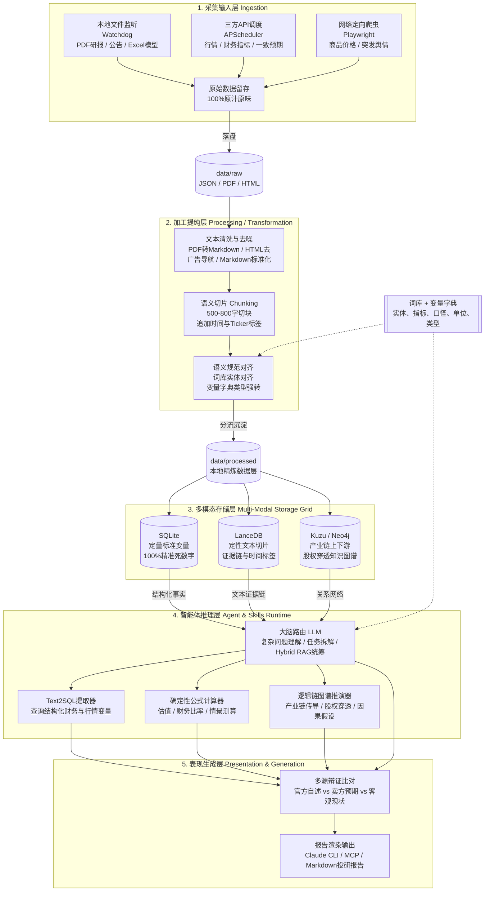
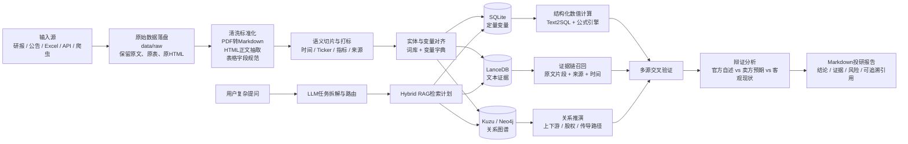
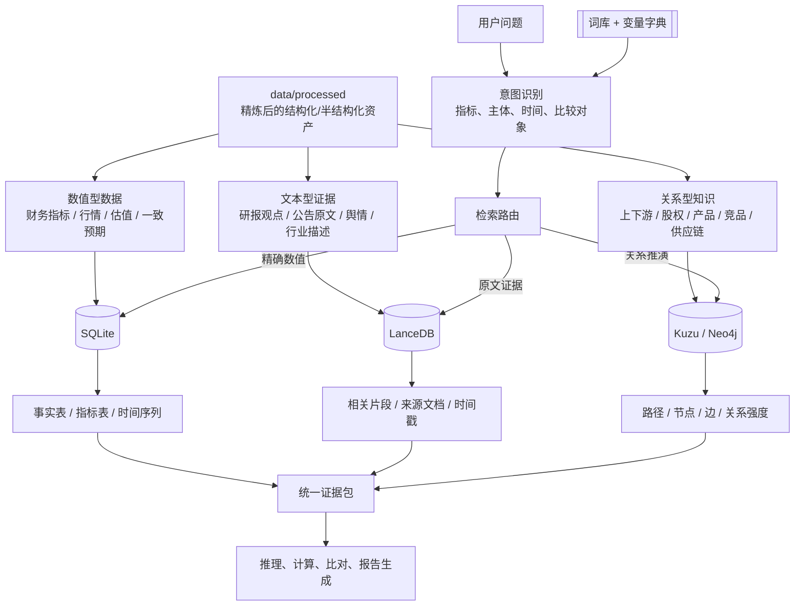

# 有道云笔记流程图源码

使用方式：

1. 在有道云笔记中新建或编辑笔记。
2. 选择插入流程图/代码图/Markdown 图表入口。
3. 分别复制下面任意一个代码块中的内容。
4. 保存后，后续要修改图形时，继续编辑这段源码即可。

## 1. 分层架构图

```mermaid
flowchart TB
    subgraph L1["1. 采集输入层 Ingestion"]
        direction TB
        L1A["本地文件监听<br/>Watchdog<br/>PDF研报 / 公告 / Excel模型"]
        L1B["三方API调度<br/>APScheduler<br/>行情 / 财务指标 / 一致预期"]
        L1C["网络定向爬虫<br/>Playwright<br/>商品价格 / 突发舆情"]
        L1D["原始数据留存<br/>100%原汁原味"]
        L1A --> L1D
        L1B --> L1D
        L1C --> L1D
    end

    RAW[("data/raw<br/>JSON / PDF / HTML")]

    subgraph L2["2. 加工提纯层 Processing / Transformation"]
        direction TB
        L2A["文本清洗与去噪<br/>PDF转Markdown / HTML去广告导航 / Markdown标准化"]
        L2B["语义切片 Chunking<br/>500-800字切块<br/>追加时间与Ticker标签"]
        L2C["语义规范对齐<br/>词库实体对齐<br/>变量字典类型强转"]
    end

    PROCESSED[("data/processed<br/>本地精炼数据层")]

    subgraph L3["3. 多模态存储层 Multi-Modal Storage Grid"]
        direction LR
        SQL[("SQLite<br/>定量标准变量<br/>100%精准死数字")]
        VEC[("LanceDB<br/>定性文本切片<br/>证据链与时间标签")]
        GRAPH[("Kuzu / Neo4j<br/>产业链上下游<br/>股权穿透知识图谱")]
    end

    DICT[["词库 + 变量字典<br/>实体、指标、口径、单位、类型"]]

    subgraph L4["4. 智能体推理层 Agent & Skills Runtime"]
        direction TB
        L4A["大脑路由 LLM<br/>复杂问题理解 / 任务拆解 / Hybrid RAG统筹"]
        L4B["Text2SQL提取器<br/>查询结构化财务与行情变量"]
        L4C["确定性公式计算器<br/>估值 / 财务比率 / 情景测算"]
        L4D["逻辑链图谱推演器<br/>产业链传导 / 股权穿透 / 因果假设"]
    end

    subgraph L5["5. 表现生成层 Presentation & Generation"]
        direction TB
        L5A["多源辩证比对<br/>官方自述 vs 卖方预期 vs 客观现状"]
        L5B["报告渲染输出<br/>Claude CLI / MCP / Markdown投研报告"]
    end

    L1D -->|"落盘"| RAW
    RAW --> L2A --> L2B --> L2C
    L2C -->|"分流沉淀"| PROCESSED
    PROCESSED --> SQL
    PROCESSED --> VEC
    PROCESSED --> GRAPH
    DICT -.-> L2C
    DICT -.-> L4A
    SQL -->|"结构化事实"| L4A
    VEC -->|"文本证据链"| L4A
    GRAPH -->|"关系网络"| L4A
    L4A --> L4B
    L4A --> L4C
    L4A --> L4D
    L4B --> L5A
    L4C --> L5A
    L4D --> L5A
    L4A --> L5A --> L5B
```

## 2. 端到端流程图

```mermaid
flowchart LR
    A["输入源<br/>研报 / 公告 / Excel / API / 爬虫"] --> B["原始数据落盘<br/>data/raw<br/>保留原文、原表、原HTML"]
    B --> C["清洗标准化<br/>PDF转Markdown<br/>HTML正文抽取<br/>表格字段规范"]
    C --> D["语义切片与打标<br/>时间 / Ticker / 指标 / 来源"]
    D --> E["实体与变量对齐<br/>词库 + 变量字典"]

    E --> F1[("SQLite<br/>定量变量")]
    E --> F2[("LanceDB<br/>文本证据")]
    E --> F3[("Kuzu / Neo4j<br/>关系图谱")]

    Q["用户复杂提问"] --> R["LLM任务拆解与路由"]
    R --> S["Hybrid RAG检索计划"]
    S --> F1
    S --> F2
    S --> F3

    F1 --> T["结构化数值计算<br/>Text2SQL + 公式引擎"]
    F2 --> U["证据链召回<br/>原文片段 + 来源 + 时间"]
    F3 --> V["关系推演<br/>上下游 / 股权 / 传导路径"]

    T --> W["多源交叉验证"]
    U --> W
    V --> W

    W --> X["辩证分析<br/>官方自述 vs 卖方预期 vs 客观现状"]
    X --> Y["Markdown投研报告<br/>结论 / 证据 / 风险 / 可追溯引用"]
```

## 3. 数据分流与检索映射图

```mermaid
flowchart TB
    P["data/processed<br/>精炼后的结构化/半结构化资产"]

    P --> A["数值型数据<br/>财务指标 / 行情 / 估值 / 一致预期"]
    P --> B["文本型证据<br/>研报观点 / 公告原文 / 舆情 / 行业描述"]
    P --> C["关系型知识<br/>上下游 / 股权 / 产品 / 竞品 / 供应链"]

    A --> SQL[("SQLite")]
    B --> VDB[("LanceDB")]
    C --> GDB[("Kuzu / Neo4j")]

    Q["用户问题"] --> I["意图识别<br/>指标、主体、时间、比较对象"]
    DIC[["词库 + 变量字典"]] --> I
    I --> M["检索路由"]

    M -->|"精确数值"| SQL
    M -->|"原文证据"| VDB
    M -->|"关系推演"| GDB

    SQL --> A1["事实表 / 指标表 / 时间序列"]
    VDB --> B1["相关片段 / 来源文档 / 时间戳"]
    GDB --> C1["路径 / 节点 / 边 / 关系强度"]

    A1 --> O["统一证据包"]
    B1 --> O
    C1 --> O
    O --> R["推理、计算、比对、报告生成"]
```
